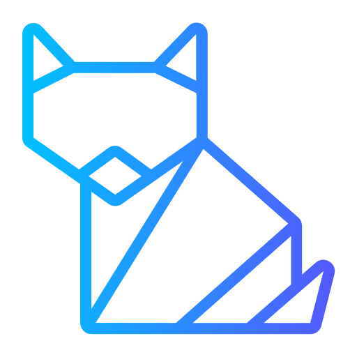
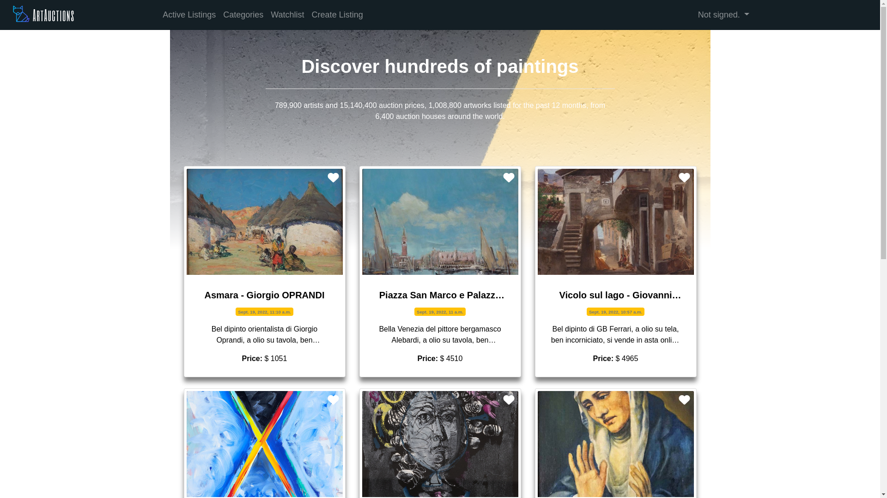
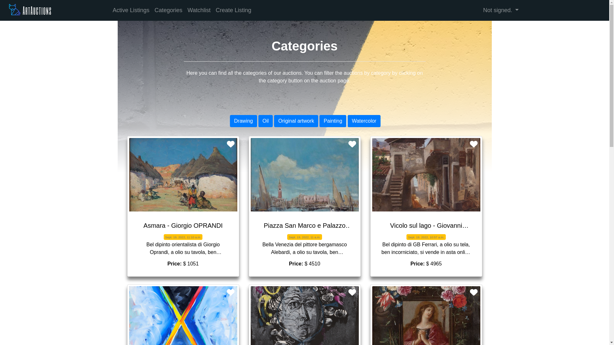
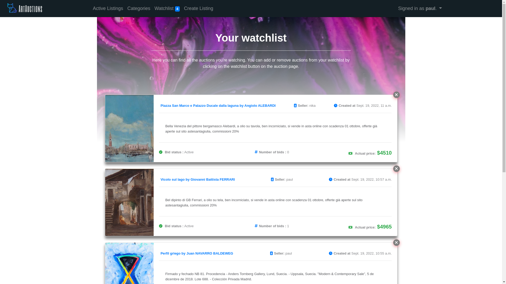
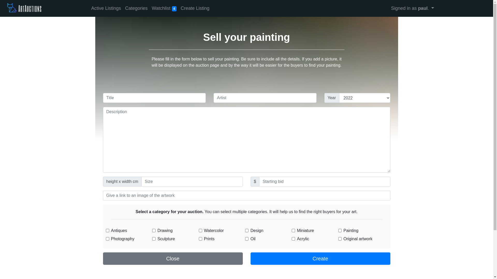

<div align="center" id="top"> 
  
  <h1>Artauctions</h1>
</div>

<p align="center">
      
</p>

<p align="center">
  <a href="#dart-about">About</a> &#xa0; | &#xa0; 
  <a href="#sparkles-features">Features</a> &#xa0; | &#xa0;
  <a href="#rocket-technologies">Technologies</a> &#xa0; | &#xa0;
  <a href="#white_check_mark-requirements">Requirements</a> &#xa0; | &#xa0;
  <a href="#checkered_flag-starting">Starting</a> &#xa0; | &#xa0;
  <a href="#memo-license">License</a> &#xa0; 
  <!--| &#xa0; <a href="https://github.com/NDRBAXgit " target="_blank">Author</a> -->
</p>

<br>

## :dart: About

An eBay-like e-commerce auction site that will allow users to post auction listings, place bids on listings, comment on those listings, and add listings to a “watchlist.”

## :sparkles: Features

:heavy_check_mark: Create Listing\
:heavy_check_mark: Add items to watchlist\
:heavy_check_mark: Bid and sell\
:heavy_check_mark: Post comments

<div align="center">




</div>

## :rocket: Technologies

The following tools were used in this project:

- [Python](https://www.python.org/)
- [Django](https://www.djangoproject.com/)
- [Bootstrap 4.4](https://getbootstrap.com/docs/4.4/getting-started/introduction/)

## :white_check_mark: Requirements

Before starting :checkered_flag:, you need to have [Python](https://www.python.org/) and [pip](https://pypi.org/project/pip/) installed.

## :checkered_flag: Starting

```bash
# Clone this project
$ git clone https://github.com/NDRBAX/ArtAuctions

# Access
$ cd ArtAuctions

# Run
$ python manage.py runserver

```

Made with :heart: by <a href="https://github.com/NDRBAX" target="_blank">NDRBAX</a>

&#xa0;

Project logo - <a href="https://www.flaticon.com/free-icons/art-and-design" title="art and design icons">Art and design icons created by RA_IC0N21 - Flaticon</a>

<a href="#top">Back to top</a>
